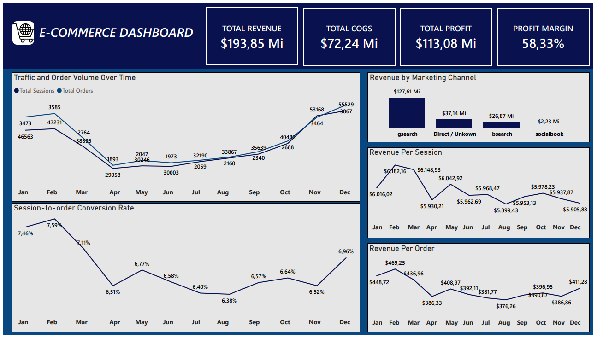

# 📊 E-Commerce Dashboard – Power BI

## 🎯 Objetivo
Analisar o desempenho de um e-commerce fictício (Maven Fuzzy Factory) a partir de dados de tráfego,
pedidos e marketing digital, com foco em entender tendências de acesso, conversão, receita
e performance dos canais de marketing ao longo do tempo.

O Dashboard foi desenvolvido com o objetivo de simular análises comuns no dia a dia de um
Analista de Dados / BI, apoiando a tomada de decisão baseada em dados.

O Dashboard e as métricas foram desenvolvidos em inglês com o objetivo de praticar a linguagem e simular projetos voltados a empresas e contextos internacionais.

---

## 🧰 Ferramentas Utilizadas
- Power BI
- DAX
- Excel / CSV (dataset público)

---

## 🧹 Preparação dos Dados e Modelagem
- Limpeza e organização dos dados (tratamento de valores nulos e padronização de campos)
- Criação de medidas em DAX para cálculo de métricas de negócio
- Modelagem orientada à análise de conversão, receita e lucratividade

---

## 📈 Principais Métricas
- Total Revenue (Receita Total)
- Total COGS (Custo dos Produtos Vendidos) 
- Total Profit (Lucro Total)
- Profit Margin (%) (Margem de Lucro %)
- Total Sessions (Total de Sessões)
- Total Orders (Total de Pedidos)
- Session-to-Order Conversion Rate (%) (Percentual de sessões que resultaram em pedidos) 
- Revenue per Session (Receita por Sessão)
- Revenue per Order (Average Order Value) (Receita por Pedido - Ticket Médio) 

---

## 📊 Análises Realizadas
- Evolução do volume de tráfego (sessions) e pedidos ao longo do tempo  
- Tendência da taxa de conversão de sessões em pedidos  
- Evolução da receita por sessão  
- Evolução do ticket médio (receita por pedido)  
- Comparação de receita entre canais de marketing  

---

## 📌 Destaques do Dashboard
- Identificação de tendências mensais de acesso e vendas  
- Avaliação da eficiência dos canais de marketing  
- Análise de rentabilidade considerando custo (COGS) e lucro  
- Visão clara da relação entre tráfego, conversão e receita  

---

## 🖼️ Dashboard

---

## 📂 Arquivos Disponíveis
- 📄 [Dashboard em PDF](Analise_Ecommerce_Portfolio.pdf)

> ℹ️ O arquivo `.pbix` não foi incluído no repositório devido ao tamanho elevado do dataset.

